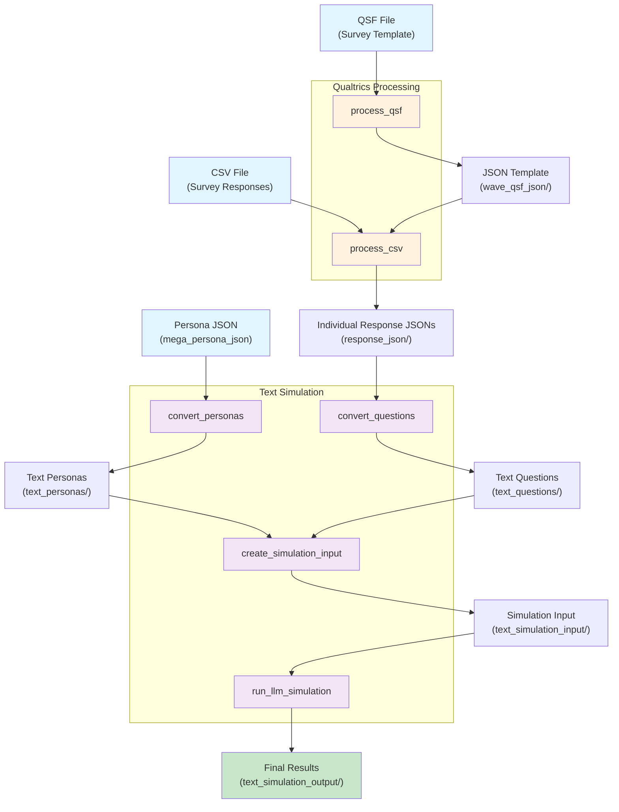

# Digital Twin Simulation

This repository contains code for simulating digital twins using Large Language Models (LLMs), for the purpose of reproducing the experiments in Twin-2K-500 (paper coming out soon). The project focuses on creating and simulating digital twins based on persona profiles and survey responses.

## Overview

The digital twin simulation system creates virtual representations of individuals based on their survey responses and simulates their behavior in response to new survey questions. The system uses LLMs to generate realistic responses that maintain consistency with the original persona profiles.

The complete pipeline consists of:
1. **Survey Processing**: Converting Qualtrics QSF files and CSV responses into structured JSON
2. **Persona Processing**: Converting persona data to text format
3. **Question Processing**: Converting questions to text prompts
4. **Simulation Input Creation**: Combining personas and questions for LLM simulation
5. **LLM Simulation**: Running the actual digital twin simulations

## Project Structure

```
.
├── configs/                   # Configuration files and Snakemake workflow
│   ├── idea_generation.yaml  # Configuration for idea generation study
│   ├── story_beliefs.yaml    # Configuration for story beliefs study
│   └── README.md             # Configuration documentation
├── Snakefile                 # Main Snakemake workflow definition
├── data/                     # Data organization by study
│   ├── idea_generation/      # Idea generation study data
│   │   ├── raw_data/         # Raw QSF and CSV files
│   │   ├── wave_qsf_json/    # Processed survey templates
│   │   └── response_json/    # Processed survey responses
│   ├── story_beliefs/        # Story beliefs study data
│   └── mega_persona_json/    # Persona profile data
├── processing_qualtrics_qsf/ # QSF file processing
│   ├── flow_elements_types/  # Flow element parsers
│   ├── question_types/       # Question type processors
│   └── parse_qsf.py         # Main QSF parser
├── processing_qualtrics_csv/ # CSV response processing
├── text_simulation/          # Main simulation code
│   ├── text_personas/        # Persona profile data (generated)
│   ├── text_questions/       # Survey questions (generated)
│   ├── text_simulation_input/ # Combined input files (generated)
│   └── text_simulation_output/ # Simulation results (generated)
├── evaluation/              # Evaluation folder  
├── scripts/                 # Utility scripts
│   └── run_pipeline.sh      # Main pipeline execution script
└── cache/                   # Cached data
```

## Requirements

- Python 3.11.7 or higher
- Poetry for dependency management
- Snakemake for workflow management
- OpenAI API key (for LLM simulation)

## Installation

1. Clone the repository:
```bash
git clone [repository-url]
cd Digital-Twin-Mega-Study
```

2. Install dependencies using Poetry:
```bash
poetry install
```

3. Download the Persona Dataset
```bash
poetry run python download_dataset.py
```

4. Set up your OpenAI API key:
```bash
# Create a .env file with your API key
echo "OPENAI_API_KEY=your_actual_api_key_here" > .env
```

## Data Organization

### Setting Up Your Study Data

For each study (e.g., "idea_generation", "story_beliefs"), organize your data as follows:

1. **Create the study folder structure**:
```bash
mkdir -p data/your_study_name/raw_data
mkdir -p data/your_study_name/wave_qsf_json
mkdir -p data/your_study_name/response_json
```

2. **Place your raw files**:
   - Put your **QSF files** in: `data/your_study_name/raw_data/`
   - Put your **response CSV files** in: `data/your_study_name/raw_data/`

3. **Create a configuration file**:
   - Copy `configs/idea_generation.yaml` to `configs/your_study_name.yaml`
   - Update the file paths to match your study structure

## Pipeline Execution Order
Our workflow is origanized by the following. We use Snakemake to manage the workflow. 


**Pipeline Steps:**

1. **process_qsf**: Convert QSF → JSON template
2. **process_csv**: Process CSV responses → Individual response JSONs
3. **convert_personas**: Convert persona data → Text format
4. **convert_questions**: Convert questions → Text prompts
5. **create_simulation_input**: Combine personas + questions → Simulation inputs
6. **run_llm_simulation**: Execute LLM simulation → Final results


## Configuration Files

Each study requires a YAML configuration file in the `configs/` directory. Here's the structure using `idea_generation.yaml` as an example:

```yaml
# QSF Processing Configuration
qsf_to_json:
  input_file: data/idea_generation/raw_data/Measures_of_Creativity_Digital_Twins_Toubia.qsf
  output_file: data/idea_generation/wave_qsf_json/Measures_of_Creativity_Digital_Twins_Toubia_parsed.json
  exclude_blocks: ["consent and screening-digital twins"]  # Optional: blocks to exclude

# CSV Response Processing Configuration
csv_to_fill_answers:
  input_survey_template: data/idea_generation/wave_qsf_json/Measures_of_Creativity_Digital_Twins_Toubia_parsed.json
  input_csv_file: data/idea_generation/raw_data/response.csv
  output_dir: data/idea_generation/response_json
  limit: -1  # -1 for all participants, or specify a number

# Text Simulation Configuration
text_simulation:
  # Convert personas to text format
  personas_to_texts:
    persona_json_dir: data/mega_persona_json/mega_persona
    output_text_dir: text_simulation/text_personas
    persona_variant: full

  # Convert questions to text prompts
  questions_to_texts:
    input_path: data/idea_generation/response_json
    output_dir: text_simulation/text_questions
    include_reasoning: true  # true for creative tasks, false for factual

  # Create simulation input files
  create_text_simulation_input:
    persona_text_dir: data/full_persona_text
    question_prompts_dir: text_simulation/text_questions
    output_combined_prompts_dir: text_simulation/text_simulation_input

  # LLM Simulation Configuration
  LLM_simulation:
    input_dir: text_simulation/text_simulation_input
    output_dir: text_simulation/text_simulation_output
    question_json_base_dir: data/idea_generation/response_json
    output_updated_questions_dir: text_simulation/text_simulation_output/response_json_llm_imputed
    system_instruction: |
      You are an AI assistant. Your task is to answer the 'New Survey Question' as if you are the person described in the 'Persona Profile' (which consists of their past survey responses). 
      Adhere to the persona by being consistent with their previous answers and stated characteristics. 
      Follow all instructions provided for the new question carefully regarding the format of your answer.
    LLM_config:
      provider: "openai"
      model_name: "gpt-4.1"          # Model to use
      temperature: 1.0               # 1.0 for creative tasks, 0.0 for factual
      max_tokens: 16384
      max_retries: 10
    num_workers: 300                 # Parallel processing workers
    force_regenerate: false          # Set to true to overwrite existing outputs
    max_personas: -1                 # -1 for all, or specify number
```

### Configuration Options Explained

- **exclude_blocks**: List of survey blocks to exclude from processing
- **include_reasoning**: Whether to include reasoning in question prompts (true for creative tasks)
- **temperature**: LLM creativity (0.0 = deterministic, 1.0 = creative)
- **max_personas**: Limit number of personas processed (-1 for all)
- **force_regenerate**: Whether to overwrite existing simulation outputs

## Usage

The pipeline is managed using Snakemake, which builds a Directed Acyclic Graph (DAG) based on the workflow rules defined in `Snakefile`. Snakemake automatically determines which steps need to be run based on file dependencies and timestamps.

### Running the Complete Pipeline

```bash
# Run the complete pipeline for idea generation study
poetry run snakemake --configfile configs/idea_generation.yaml --cores 1

# Run with multiple cores for faster processing
poetry run snakemake --configfile configs/idea_generation.yaml --cores 4

# Run for a different study (e.g., story_beliefs)
poetry run snakemake --configfile configs/story_beliefs.yaml --cores 4
```

### Available Snakemake Rules

The `Snakefile` defines the following rules that correspond to each pipeline step:

- `process_qsf`: Convert QSF files to JSON templates
- `process_csv`: Process CSV responses to individual JSON files
- `convert_personas`: Convert persona data to text format
- `convert_questions`: Convert questions to text prompts  
- `create_simulation_input`: Combine personas and questions
- `run_llm_simulation`: Execute LLM digital twin simulation

### Forcing Rule Execution

By default, Snakemake skips rules if output files are newer than input files. Since Python code changes aren't automatically detected, you may need to force execution:

```bash
# Force all rules to run regardless of file timestamps
poetry run snakemake --configfile configs/idea_generation.yaml --cores 4 --forceall

# Force a specific rule and all downstream dependencies
poetry run snakemake --configfile configs/idea_generation.yaml --cores 4 --forcerun process_qsf

# Force multiple specific rules
poetry run snakemake --configfile configs/idea_generation.yaml --cores 4 --forcerun process_qsf --forcerun convert_personas
```

### Running Individual Pipeline Components

Very often you are working on a specific component of the workflow. To test or run specific components without executing the entire pipeline:

```bash
# Run only the persona conversion step
poetry run snakemake convert_personas --configfile configs/idea_generation.yaml --cores 4 --forcerun convert_personas

# Run only the QSF processing step
poetry run snakemake process_qsf --configfile configs/idea_generation.yaml --cores 4 --forcerun process_qsf

# Run up to question conversion (includes all prerequisite steps)
poetry run snakemake convert_questions --configfile configs/idea_generation.yaml --cores 4 --forcerun convert_questions
```

When you specify a target rule, Snakemake builds a DAG that includes only that rule and its dependencies, making it efficient for testing individual components.

### Dry run the Workflow

To understand better how Snakemake works, you can do
```bash
# Show which files would be created/updated (dry run)
poetry run snakemake --configfile configs/idea_generation.yaml --cores 1 --dry-run

# Generate a workflow diagram (requires graphviz)
poetry run snakemake --configfile configs/idea_generation.yaml --dag | dot -Tpng > workflow.png

# Show detailed execution plan
poetry run snakemake --configfile configs/idea_generation.yaml --cores 1 --dry-run --printshellcmds
``` 


## Troubleshooting

### Common Issues

1. **Missing API Key**:
   ```bash
   # Make sure your .env file contains:
   echo "OPENAI_API_KEY=your_actual_api_key_here" > .env
   ```

2. **File path errors**:
   - Ensure all paths in your configuration file are relative to the project root
   - Check that raw data files exist in the specified locations

3. **Memory issues with large datasets**:
   - Use `--max_personas=N` to limit the number of participants
   - Adjust `limit` in your configuration file

4. **Snakemake doesn't detect changes**:
   - Use `--forcerun <rule_name>` to force rebuilding specific rules and their dependencies
   - Use `--forceall` to force complete rebuild of all rules
   - Use `--delete-all-output` followed by a normal run to completely rebuild from scratch

5. **LLM simulation fails**:
   - Check your OpenAI API key and quota
   - Reduce `num_workers` if hitting rate limits
   - Check `max_retries` setting in LLM_config

### Output Verification

After running the pipeline, you should see these directories populated:

```bash
# For idea_generation study:
data/idea_generation/wave_qsf_json/          # Survey templates
data/idea_generation/response_json/          # Individual responses
text_simulation/text_personas/               # Text personas
text_simulation/text_questions/              # Text questions
text_simulation/text_simulation_input/       # Combined inputs
text_simulation/text_simulation_output/      # Final simulation results
```

## ML Prediction with XGBoost

In addition to LLM-based digital twins, this repository includes a machine learning approach using XGBoost to predict survey responses based on persona features.

```bash
# Train XGBoost models
poetry run python ml_prediction/predict_answer_xgboost.py \
    --config ml_prediction/ml_prediction_config.yaml

# Evaluate predictions with MAD
poetry run python ml_prediction/prepare_xgboost_for_mad.py --run-mad
```

For more details and options, see `ml_prediction/README.md`.

## Meta-Analysis of Results

After running simulations, analyze results across all studies and specifications:

```bash
# Combine all meta-analysis results into a single CSV
poetry run python mega_study_evaluation/combine_all_meta_analyses.py
```

This creates a comprehensive CSV file combining all studies across all specifications with:
- Specification types (e.g., "full_persona_without_reasoning") 
- Run dates parsed from directory names
- All original meta-analysis metrics from individual studies

Results are saved to `mega_study_evaluation/meta_analysis_results/combined_all_specifications_meta_analysis_{timestamp}.csv`

For individual study analysis and advanced meta-analysis options, see `mega_study_evaluation/README.md`.

## Contributing

When adding new studies or modifying processing logic:

1. Create appropriate data folder structure
2. Add configuration file in `configs/`
3. Test processing pipeline with Snakemake
4. Document any new configuration options
5. Update this README if needed

For more detailed documentation on individual components, see the `configs/README.md` file.
